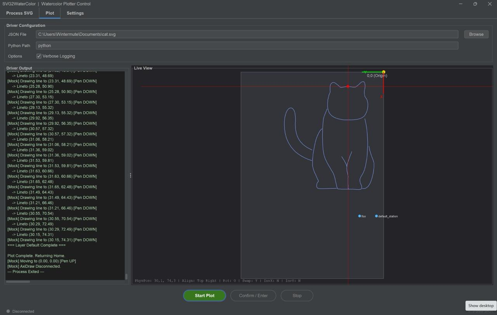

# SVG2WaterColor



A two-stage pipeline that transforms multi-layered SVG vector designs into physical watercolor paintings via pen plotter. The system handles the unique challenges of painting with real brushes and water-based paint: automatic refill scheduling, multi-station paint management, and precise coordinate mapping between digital canvas and physical machine.

Supports both AxiDraw (via pyaxidraw) and G-code/GRBL plotters out of the box.

## How It Works

```
SVG (Inkscape layers) --> Java Processor --> commands.json --> Python Driver --> Physical Plot
```

**Stage 1 -- Java Preprocessor:** Parses the SVG, identifies color layers (Inkscape layer names = paint station IDs), converts all primitives to paths, linearizes curves, segments strokes by paint capacity (`maxDrawDistance`), and inserts automatic refill commands.

**Stage 2 -- Python Driver:** Reads the command JSON and drives the physical plotter via pyaxidraw or G-code over USB. Handles pen up/down, refill dip sequences at configured station coordinates, inter-layer brush changes (with user prompts), and real-time position reporting.

## Key Features

- **Multi-Backend Support** -- AxiDraw (pyaxidraw API) and G-code (GRBL via USB) with a pluggable backend abstraction
- **Paint Capacity Management** -- Tracks brush ink distance, auto-inserts REFILL commands with calculated split points when strokes exceed capacity
- **Multi-Layer / Multi-Color** -- SVG layers map to physical paint stations, each with configurable XY position and dip behavior
- **Configurable Machine Origin** -- Supports plotters with home position at any corner (Top-Left, Top-Right, Bottom-Left, Bottom-Right); automatically derives axis inversion from origin selection
- **Canvas Alignment** -- Snap drawings to any corner or center of the machine bed, with padding offsets
- **Live Visualization** -- Digital twin that accurately previews the physical plot for any origin/alignment/rotation configuration
- **Primitive Normalization** -- Converts `<rect>`, `<circle>`, `<ellipse>`, `<line>`, `<polyline>`, `<polygon>` to paths
- **Curve Linearization** -- PathIterator-based, configurable step size (default 0.5mm)
- **Auto-Scaling** -- Fit-to-page for A5/A4/A3/XL with padding
- **Swing GUI** -- Dark-themed (FlatDarkLaf) interface with SVG processing, live visualization, station management, plotter settings, and manual jog controls
- **Mock Mode** -- Full simulation without hardware for testing and preview

## Prerequisites

### Java (Stage 1)
- Java 17+
- Maven 3.6+

### Python (Stage 2)
- Python 3.8+
- Dependencies: `pip install -r driver/requirements.txt`
- For AxiDraw: Official AxiDraw software (includes pyaxidraw API)
- For G-code/GRBL: pyserial (`pip install pyserial`)

## Build & Run

### Build Java Processor
```bash
mvn clean package
```

### Run GUI
```bash
# Linux/macOS
java -jar target/watercolor-processor-1.0-SNAPSHOT.jar --gui

# Windows
run_gui.bat
```

### Run CLI (Java Processor)
```bash
java -jar target/watercolor-processor-1.0-SNAPSHOT.jar \
  -i input.svg -o commands.json -f A4 -p 10 -d 150
```

| Flag | Description | Default |
|------|-------------|---------|
| `-i` | Input SVG file | (required) |
| `-o` | Output JSON file | (required) |
| `-d` | Max draw distance before refill (mm) | (required) |
| `-s` | Default station ID | `default_station` |
| `-c` | Curve approximation step (mm) | `0.5` |
| `-f` | Fit to format (A5/A4/A3/XL) | none |
| `-p` | Padding (mm) | `10.0` |

### Run Python Driver (CLI)
```bash
python driver/driver.py commands.json [OPTIONS]
```

**Common examples:**
```bash
# Mock mode (no hardware)
python driver/driver.py commands.json --mock --verbose

# AxiDraw with custom config
python driver/driver.py commands.json --config project.json --speed-down 50

# G-code plotter with bottom-left origin
python driver/driver.py commands.json --backend gcode --machine-origin bottom-left --mock

# Align drawing to center with padding
python driver/driver.py commands.json --canvas-align center --padding-x 10 --padding-y 10
```

See the [Driver CLI Reference](#driver-cli-reference) below for all options.

## GUI Overview

The application has three tabs:

### Process SVG
Configure and run the SVG-to-JSON conversion. Select input/output files, set draw distance, curve step, paper format, and padding. Progress bar shows conversion status.

### Plot
Control the physical plotting process. Select the commands.json file, start/stop the driver, and view real-time output in the dark-themed console. The right-hand **Live View** panel shows a digital twin of the machine bed with:
- Machine bed outline with origin marker and axis indicators
- Drawing paths in their actual aligned position
- Paint station markers
- Real-time cursor tracking during plotting

### Settings
Configure hardware and calibration. Four sections:

**Hardware** -- Select backend (AxiDraw or G-code), plotter model/size, orientation, and backend-specific settings. AxiDraw settings include model, speeds, and pen heights. G-code settings include serial port, baud rate, pen control mode (servo/Z-axis/M3-M5), feed rates, and machine dimensions.

**Coordinate Mapping** -- Set the machine origin corner, axis swap, canvas alignment, data rotation, and padding. The "Machine Origin" dropdown replaces the old invertX/invertY checkboxes with a single intuitive control.

**Paint Stations** -- Add, edit, and remove paint refill stations with X/Y positions, pen-down depth, and dip behavior (simple dip or dip+swirl).

**Manual Control** -- Jog the plotter head with directional buttons or arrow keys, test pen up/down. Step size is configurable. Jog directions automatically adapt to the selected machine origin.

## Plotter Backend Support

### AxiDraw
The default backend. Uses the pyaxidraw API to control AxiDraw V3 (A4) and V3 XL (A3) plotters. Pen height and speed are configured as percentages.

### G-code (GRBL)
For GRBL-compatible CNC and plotter machines. Connects via USB (appears as a virtual serial port, driven by pyserial). Supports three pen control modes:

| Mode | Commands | Use Case |
|------|----------|----------|
| Servo (M280) | `M280 P{pin} S{angle}` | RC servo for pen lift |
| Z-Axis | `G0/G1 Z{height}` | Motorized Z-axis |
| M3/M5 | `M3` (down) / `M5` (up) | Spindle relay or solenoid |

G-code settings are stored in the `gcode` section of `config.json` and include serial port, baud rate, feed rates, servo angles or Z positions, and machine dimensions.

### Mock
A simulation backend that prints commands to the console without hardware. Activated with `--mock` for any backend. Useful for testing and previewing.

## Machine Origin & Coordinate System

The plotter's home position (motor 0,0) can be at any corner. This is configured via the **Machine Origin** setting in the GUI or `--machine-origin` on the CLI.

```
Machine Origin = "Top-Right" (AxiDraw default)

  +-----------------------+ (0,0) Origin
  |                       |  <-- +X
  |     Machine Bed       |
  |                       |  |
  +-----------------------+  v +Y

Machine Origin = "Bottom-Left" (common GRBL)

  (0,0) Origin
  +-----------------------+
  ^                       |
  +Y   Machine Bed       |
  |                       |
  +-----------------------+
       +X -->
```

The system automatically derives the correct axis inversions:
- Origin on the **right** side: X axis is inverted (SVG +X is right, motor +X is left)
- Origin on the **bottom**: Y axis is inverted (SVG +Y is down, motor +Y is up)

Swap X/Y remains a separate toggle for plotters whose motor axes are physically rotated 90 degrees.

## Configuration

All settings are persisted in `config.json`:

```json
{
  "general": {
    "modelIndex": 1,
    "mock": false,
    "machineOrigin": "Top-Right",
    "swapXY": true,
    "speedDown": 25,
    "speedUp": 75,
    "penUp": 60,
    "penDown": 30,
    "orientation": "Portrait",
    "canvasAlignment": "Top Right",
    "viewRotation": 0,
    "paddingX": 0.0,
    "paddingY": 0.0,
    "backend": "axidraw",
    "gcode": {
      "serial_port": "/dev/ttyUSB0",
      "baud_rate": 115200,
      "pen_mode": "servo",
      "servo_pin": 0,
      "feed_rate_draw": 1000,
      "feed_rate_travel": 3000,
      "pen_servo_up": 60,
      "pen_servo_down": 30,
      "z_up": 5.0,
      "z_down": 0.0,
      "machine_width": 300.0,
      "machine_height": 200.0
    }
  },
  "stations": {
    "red_wash": { "x": 5.0, "y": 100.0, "z_down": 30, "behavior": "dip_swirl" },
    "blue_detail": { "x": 30.0, "y": 100.0, "z_down": 30, "behavior": "simple_dip" }
  }
}
```

Old config files without `machineOrigin` are automatically migrated: the origin is inferred from the legacy `invertX`/`invertY` flags.

## Driver CLI Reference

| Argument | Type | Description |
|----------|------|-------------|
| `input` | positional | Input JSON file (optional for `--manual-pen` or `--interactive-server`) |
| **Hardware** | | |
| `--backend {axidraw,gcode}` | choice | Plotter backend (default: `axidraw`) |
| `--mock` | flag | Force simulation mode |
| `--model N` | int | AxiDraw model (1=A4, 2=A3/XL) |
| `--serial-port PATH` | string | Serial port for G-code backend |
| `--machine-width MM` | float | Machine width in mm (G-code) |
| `--machine-height MM` | float | Machine height in mm (G-code) |
| **Coordinate Mapping** | | |
| `--machine-origin CORNER` | choice | Origin corner: `top-left`, `top-right`, `bottom-left`, `bottom-right` |
| `--swap-xy` | flag | Swap motor X and Y axes |
| `--invert-x` | flag | Invert X axis (auto-derived from `--machine-origin`) |
| `--invert-y` | flag | Invert Y axis (auto-derived from `--machine-origin`) |
| `--canvas-align POSITION` | choice | Align content: `top-left`, `top-right`, `bottom-left`, `bottom-right`, `center` |
| `--origin-right` | flag | Machine origin is on the right (auto-derived from `--machine-origin`) |
| `--data-rotation DEG` | choice | Rotate drawing: `0`, `90`, `180`, `270` |
| `--padding-x MM` | float | X padding for alignment |
| `--padding-y MM` | float | Y padding for alignment |
| **Pen & Speed** | | |
| `--speed-down N` | int | Drawing speed 1-100% (AxiDraw) |
| `--speed-up N` | int | Travel speed 1-100% (AxiDraw) |
| `--pen-up N` | int | Pen up height 0-100% (AxiDraw) |
| `--pen-down N` | int | Pen down height 0-100% (AxiDraw) |
| **Manual Control** | | |
| `--manual-pen {UP,DOWN}` | choice | Manually raise/lower pen and exit |
| `--move-x MM` | float | Manual X jog (mm) |
| `--move-y MM` | float | Manual Y jog (mm) |
| **Operational** | | |
| `--interactive-server` | flag | Persistent stdin/stdout server mode (used by GUI) |
| `--report-position` | flag | Stream `POS:X:val:Y:val` to stdout for live visualization |
| `--config PATH` | string | Path to config.json |
| `--verbose` | flag | Detailed logging |

## Command JSON Format

The contract between the Java processor and Python driver:

```json
{
  "metadata": {
    "source": "input.svg",
    "units": "mm",
    "totalCommands": 450,
    "bounds": { "minX": 0.0, "maxX": 210.0, "minY": 0.0, "maxY": 297.0 }
  },
  "layers": [
    {
      "id": "red_wash",
      "stationId": "red_wash",
      "commands": [
        { "op": "REFILL", "id": 1, "stationId": "red_wash" },
        { "op": "MOVE", "id": 2, "x": 10.5, "y": 20.0 },
        { "op": "DRAW", "id": 3, "points": [{"x": 10.5, "y": 20.0}, {"x": 15.0, "y": 25.5}] }
      ]
    }
  ]
}
```

| Command | Fields | Description |
|---------|--------|-------------|
| `MOVE` | `x`, `y` | Pen-up travel to absolute position (mm) |
| `DRAW` | `points[]` | Pen-down polyline through list of {x, y} points |
| `REFILL` | `stationId` | Refill at named paint station |

## Project Structure

```
SVG2WaterColor/
+-- src/main/java/.../watercolorprocessor/
|   +-- WatercolorProcessor.java        # CLI entry point
|   +-- ProcessorService.java           # SVG parsing, segmentation, refill logic
|   +-- dto/                            # Data transfer objects
|   |   +-- command/                    # Command types (MOVE, DRAW, REFILL)
|   +-- gui/                            # Swing GUI
|       +-- WatercolorGUI.java          # App launcher (FlatDarkLaf theme)
|       +-- MainFrame.java             # Top-level frame with tabs + status bar
|       +-- ProcessorPanel.java         # SVG processing controls
|       +-- PlotterPanel.java           # Driver control & live visualization
|       +-- SettingsPanel.java          # Hardware, stations, manual control
|       +-- VisualizationPanel.java     # Digital twin / live view
|       +-- GeneralSettings.java        # Settings POJO (config.json serialization)
|       +-- GcodeSettings.java          # G-code backend settings POJO
|       +-- StationConfig.java          # Station definition record
|       +-- AppConfig.java              # Root config wrapper
|       +-- ProcessingWorker.java       # Async SVG processing worker
+-- driver/                             # Python hardware driver
|   +-- driver.py                       # Main entry point + CLI
|   +-- transforms.py                   # Coordinate transformation library
|   +-- backend.py                      # PlotterBackend ABC
|   +-- axidraw_backend.py              # AxiDraw adapter
|   +-- gcode_backend.py                # G-code/GRBL backend
|   +-- mock_axidraw.py                 # Simulation backend
|   +-- config.py                       # Default station + pen config
|   +-- requirements.txt                # Python dependencies
+-- docs/
|   +-- architecture.md                 # Full architecture & system spec
+-- validation/                         # Manual test procedures (5 scripts)
+-- pom.xml                             # Maven build config
+-- config.json                         # Default runtime configuration
+-- stations.json                       # Legacy station config (auto-migrated)
+-- Requirements.md                     # System requirements
+-- CHANGELOG.md                        # Version history
+-- CONTRIBUTING.md                     # Development guide
```

## Tech Stack

- **Java 17** -- SVG processing (Apache Batik 1.17), JSON (Jackson 2.15), CLI (Commons CLI), GUI (Swing + FlatLaf 3.2)
- **Python 3** -- Hardware driver, coordinate transforms, USB communication (pyserial)

## License

AGPL-3.0 -- see [LICENSE](LICENSE).

## Contributing

See [CONTRIBUTING.md](CONTRIBUTING.md).
